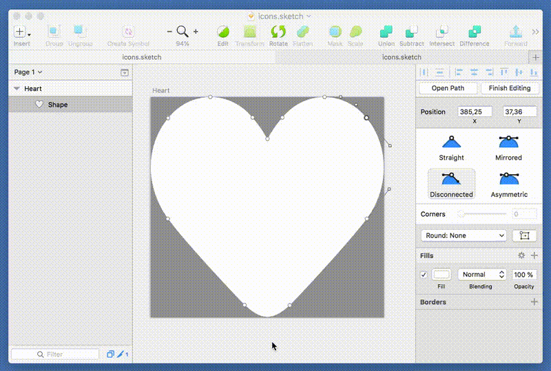

## File Actions++

Brings Alfred's Finder file actions to any document-based app. Allows you to quickly perform actions on the currently opened file.

### Usage

Shortcut `⌘.` (can be configured) brings the file action panel for the current file.

### Install

[Download and open the workflow](File Actions.alfredworkflow?raw=true).

### License

- Code: [MIT](../LICENSE)
- Icon: [icons8](https://icons8.com/license/) (CC BY-ND 3.0)