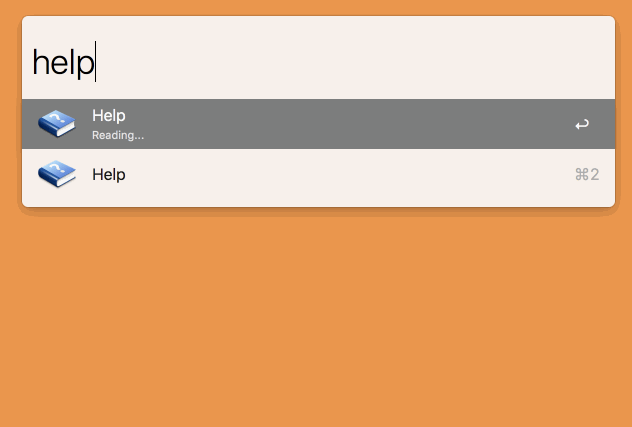

## Help

The Help Page for your Alfred Workflows.

Forgetting which keywords and shortcuts are available in your Alfred workflows, like I do? Type `help`.

### Usage

    help             📖 List available commands
    help <query>     🔍 Filter available commands
    enter            🚀 Execute the selected command

More:

`help` lists commands by keywords and shortcuts, `helptitle` lists commands by title. Customize the keywords in the variables section in Alfred Preferences.

### Install

[Download and open `Help.alfredworkflow`](Help.alfredworkflow?raw=true).

### Improvements

Ideas for improvements, just for reference. The workflow is currently working great for me so I don't have plans to necessarily implement these.

- [ ] Auto-update
- [ ] Option to include/exclude disabled workflows
- [ ] Execute hotkey on enter
- [ ] Search by workflow name, title, subtitle

### Related

If this workflow isn't for you, Jaemok Jeong's `Manage Alfred Extension` might be: [Packal](http://www.packal.org/workflow/manage-alfred-extension-0), [GitHub](https://github.com/jmjeong/alfred-extension). It's geared a bit more towards workflow developers than users.

### License

- Main Code: [MIT](../LICENSE)
- Code in `src/vendor/workflow`: [MIT](src/vendor/workflow/LICENSE.txt)
- `src/icon.png`: [CC BY 3.0](https://creativecommons.org/licenses/by/3.0/) — [Blue Help Icon](http://www.softicons.com/toolbar-icons/help-icons-by-kyo-tux/blue-help-icon) by [kyo-tux](http://www.softicons.com/designers/kyo-tux)
